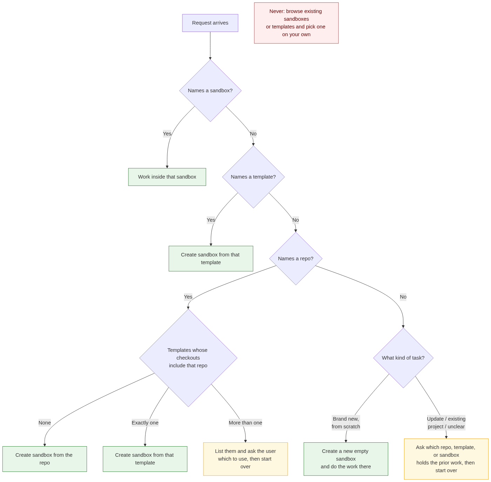
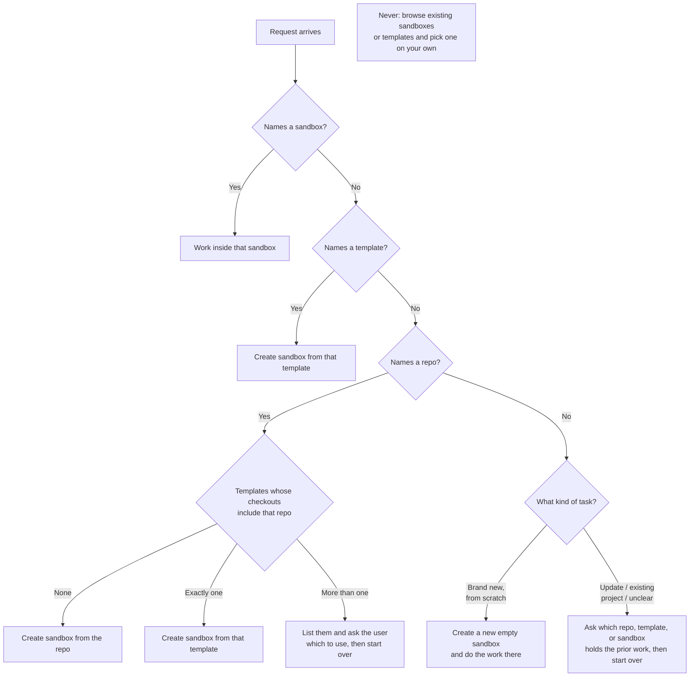

# How agents choose where to work

Every agent in this catalog that touches code or writes files does so inside a
Crafting sandbox. This page is the one rule set they all follow to decide
*which* sandbox. It exists so you can predict what an agent will do with your
org's sandboxes and templates before you launch it.



## The rules, in order

An agent works through these top to bottom and stops at the first that
applies.

1. **You name a sandbox.** The agent works in it and creates nothing. This is
   the normal case inside a team: a coordinator such as `engineering-manager`
   creates the sandbox once and hands its name to every specialist.

2. **You name a template.** The agent creates a sandbox from that template.

3. **You name a git repository URL.** The agent looks for templates in your org
   whose checkouts include that repository (`list_templates`, then
   `describe_template`).
   - **None** match: it creates a sandbox directly from the URL
     (`create_sandbox_from_repo`).
   - **Exactly one** matches: it creates a sandbox from that template, so your
     customizations (services, env, hooks) come along.
   - **More than one** matches: it lists them and asks you which. Forked
     templates for the same repo usually differ in ways the agent cannot see,
     so it does not guess.

4. **You name none of those.** What happens depends on the task.
   - The task is clearly **new work from scratch** (a product idea, a
     greenfield build): the agent creates a fresh, empty sandbox with a single
     `app` workspace and works there.
   - The task **updates, reviews, tests, or investigates something that already
     exists**, or the agent is not sure: it asks you which repository,
     template, or sandbox holds the prior work, then starts over from rule 1.
     `code-reviewer`, `qa-engineer`, and `incident-commander` are always in
     this case; there is nothing for them to review from scratch.

**In every case:** the agent never browses your existing sandboxes or
templates and picks one on its own. If it did not create the sandbox and you
did not name it, it does not touch it.

## What this means in practice

- A fresh org with no sandboxes and no code templates works. Paste a repo URL
  and the agent creates what it needs.
- Your existing sandboxes are safe. An agent will not wander into one because
  it "looked like an app."
- Your template customizations are honored when they are unambiguous, and you
  are asked when they are not.
- Sandboxes an agent creates are left running and named in its report, so you
  can inspect them or delete them.

## Which agents this applies to

| Agent | Rule 4 behavior when nothing is named |
| --- | --- |
| `software-engineer` | New from scratch → empty sandbox; otherwise asks |
| `engineering-manager` | Same, resolved once and passed to specialists |
| `pde-lead` | New product idea → empty sandbox; existing product → asks |
| `product-manager` | New spec → empty sandbox; existing product → asks |
| `design-lead` | New brief → empty sandbox; existing product → asks |
| `code-reviewer` | Always asks; a review needs an existing change |
| `qa-engineer` | Always asks; QA needs an existing change |
| `incident-commander` | Always asks; an incident needs an existing system |

`security-scanner`, `contract-analyst`, and `compliance-reviewer` run inside a
sandbox created from their own template (`exec.use_template`) and do not
choose one. `legal-counsel` coordinates the two legal specialists and does not
enter a sandbox itself.

## Agent-owned templates are not candidates

The `hub-*` templates those three agents run in are their runtime, not
templates you would start a sandbox from. Each one is published with:

```yaml
customizations:
  - property_set:
      type: crafting.dev/sandbox/llm
      properties:
        authorizedTemplate: excluded
```

Crafting hides an excluded template from the tools agents use to find
templates, so rule 3 above will never match `hub-security-scanner` against
your repository, and no agent can start a sandbox from it. The agent it
belongs to still launches normally, because `exec.use_template` resolves the
template by name rather than by matching.

## Source

The flowchart is generated from this Mermaid definition:


